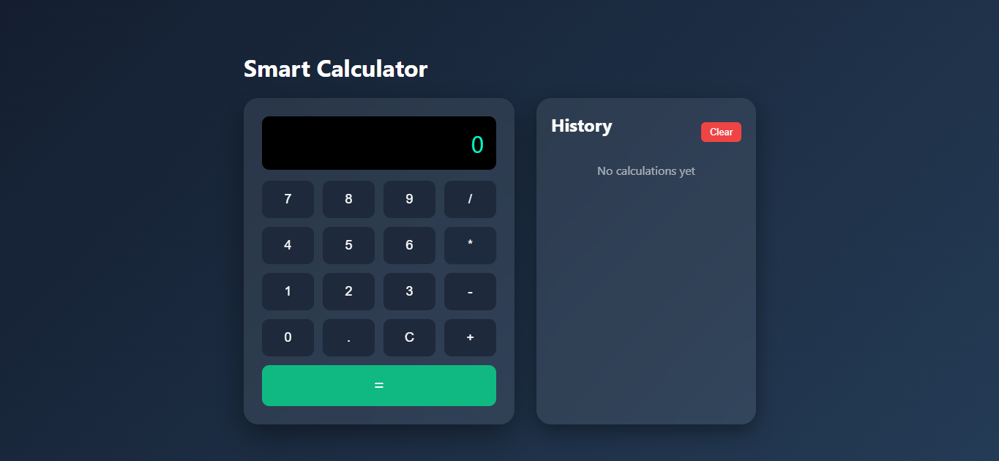

# 🧮 Smart Calculator Web App

A modern **Smart Calculator Web Application** built using **React + Vite**.  
This project provides a clean, responsive UI with a calculation history panel and persistent storage using the browser's localStorage.

---

## 🚀 Features

- Modern and responsive UI
- Built with React + Vite
- Fast and lightweight development environment
- Real-time calculations
- Calculation **History Panel**
- **Clear history** functionality
- History stored using **localStorage**
- Smooth button interactions
- Error handling for invalid expressions

---

## 📸 Application Preview



---

## 🛠️ Technologies Used

- React
- Vite
- JavaScript (ES6)
- HTML5
- CSS3
- mathjs

---

## 📂 Project Structure
```bash
smart-calculator-react
│
├── index.html
├── package.json
├── vite.config.js
│
├── src
│ ├── main.jsx
│ ├── App.jsx
│ ├── App.css
│ │
│ ├── components
│ │ ├── Calculator.jsx
│ │ ├── Button.jsx
│ │ └── History.jsx
│ │
│ └── utils
│ └── calculate.js
```


---

## ⚙️ Installation Guide

### 1️⃣ Clone the Repository

```bash
git clone https://github.com/your-username/smart-calculator-react.git
```

### 2️⃣ Navigate to the Project Folder
```bash
cd smart-calculator-react
```

### 3️⃣ Install Dependencies
```bash
npm install
```

### 4️⃣ Install mathjs
```bash
npm install mathjs
```

### 5️⃣ Run the Development Server
```bash
npm run dev
```

### Open your browser and visit:
```bash
http://localhost:5173
```


## 📊 How the Application Works

1. Users click numbers and operators.
2. The expression is built dynamically.
3. The mathjs library evaluates the expression.
4. Results appear instantly on the display.
5. Each calculation is saved in the History panel.
6. History is stored in localStorage, so it remains after refreshing.
7. The Clear button removes all saved calculations.


## 🧠 Example Calculations
```bash
5 + 5 = 10
8 * 3 = 24
12 / 4 = 3
9 - 2 = 7
```

## 📌 Future Improvements

1. Scientific calculator functions
2. Keyboard input support
3. Dark / Light theme toggle
4. Export history feature
5. Mobile UI optimization


# ⭐ If you like this project, consider giving it a star on GitHub!
